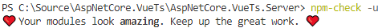

# ASP.NET Core Vue Starter

> This repository is a fork from [SoftwareAteliers/asp-net-core-vue-starter](https://github.com/SoftwareAteliers/asp-net-core-vue-starter) so I could easily create a template that suits my own needs.
> If you don't like my setup, make sure to check them out too.
> Below, the differences are described.

The repository contains an [ASP.NET Core](https://dotnet.microsoft.com/download/dotnet-core/3.1) + [Vue.js](https://vuejs.org/) starter template.
The template runs on [ASP.NET Core 3.1](https://docs.microsoft.com/en-us/aspnet/core/release-notes/aspnetcore-3.1) and is created by [Vue CLI 4.0](https://cli.vuejs.org/) with a new plugin based architecture allowing developers to interactively scaffold a new project with just a one command.

It has as of 2020-04-14 the latest packages:
> 

***Note:** You can use any frontend framework you like with this starter.*

*For ASP.NET Core 2.2 template use [didii/AspNetCore.VueTs](https://github.com/didii/AspNetCore.VueTs) instead.*

---

## Table of Contents

* [Features](#features)
* [Used Technology Stack](#used-technology-stack)
* [Prerequisites](#prerequisites)
* [Getting Started](#getting-started)

## Features

* Hot module replacement
* Code-splitting
* Tree-shaking
* ES2017 transpilation
* Long term caching
* Easy debugging in Chrome and Visual Studio Code
* ...

## Used Technology Stack

**ASP.NET Core 3.1:**

* Web.API
* SPA services to host client app

**Vue.js with CLI 4.0 supporting optional integrations:**

* TypeScript + helper libraries for even more type-safety
* Progressive Web App
* Vue Router & Vuex (State Store)
* Linting, unit testing
* ...

*For a full feature list, I suggest you to read the [official CLI release statement](https://medium.com/the-vue-point/vue-cli-3-0-is-here-c42bebe28fbb) by Evan You.*

## Prerequisites

* [.NET Core](https://www.microsoft.com/net/download/windows) >= 3.1
* [NodeJS](https://nodejs.org/) >= 8.9
* [Vue CLI](https://cli.vuejs.org/) >= 4.0
* Your favourite editor (I prefer [VS Code](https://code.visualstudio.com/) and VS 2019)

---

# Getting started

There are two ways how to set up the project: one for people who want to create their own template and choose custom integrations and the other for developers who want to start with no configuration.

## Clone the starter with default configuration

1. Clone this repository:
   `git clone https://github.com/didii/asp-net-core-vue-starter`
2. In the `AspNetCoreVueStarter\ClientApp` folder, run `npm install`

## (Optional) Scaffold Vue.js app with custom configuration

If you prefer to overwrite default Vue client app with custom settings, take the following steps:

1. **Remove all the contents** of the folder /ClientApp
2. Create a new Vue project by using Vue CLI: `vue create client-app` OR by using CLI graphical interface running `vue ui`
3. **Move all the contents from the new folder /client-app to /ClientApp.**

## Run the application

* Run the Vue app using `npm run serve` from the `AspNetCoreVueStarter\ClientApp` folder
* Run the .NET application using `dotnet run` in the root folder or hit <kbd>F5</kbd> or <kbd>Ctrl+F5</kbd> in Visual Studio

Browse to [http://localhost:65025](http://localhost:65025) for ASP.&#8203;NET Core + Vue app or browse to [http://localhost:8080](http://localhost:8080) for Vue app only.

## Debug the application

### In Chrome

In the sources tab in Chrome, press <kbd>Ctrl+P</kbd> and start searching for `Counter.vue`.
The first file that pops up should be `webpack:///.src/views/Counter.vue` which is the file only containing the typescript code.
All other files with the hashes are put in `webpack-generated:///` and are generated files which are of no use while debugging.

### In Visual Studio Code + Chrome

#### Prerequisites:

* Visual Studio Code extension: [Debugger for Chrome](https://marketplace.visualstudio.com/items?itemName=msjsdiag.debugger-for-chrome)

#### Launching Chrome

1. Run both the vue app and asp.net core app (see Run the application)
2. Press <kbd>F5</kbd> in Visual Studio Code and select the Chrome environment
   * If a folder `.vscode/launch.json` already exists, just open that file instead.
3. Use the following profile:
   ```json
    {
        "type": "chrome",
        "request": "launch",
        "name": "Launch Chrome",
        "url": "http://localhost:65025",
        "webRoot": "${workspaceFolder}/src",
        "sourceMapPathOverrides": {
            "webpack:///./src/*": "${webRoot}/*"
        }
    }
    ```
4. Press <kbd>F5</kbd> and select the Launch Chrome profile if necessary

#### Attaching Chrome

When you open Chrome, it needs to be opened with a debugger port open. 
Only then you can attach.
You can do this by running `chrome.exe --remote-debugging-port=9222 http://localhost:65025` or by using the chrome shortcut in the root folder.

When Chrome and both applications are running:

1. In Visual Studio Code, choose the attach profile for debugging
2. Press <kbd>F5</kbd> in Visual Studio Code and select the Chrome environment
   * If a folder `.vscode/launch.json` already exists, just open that file instead.
3. Use the following profile:
   ```json
    {
        "type": "chrome",
        "request": "attach",
        "name": "Attach Chrome",
        "urlFilter": "http://localhost:65025*",
        "port": 9222,
        "webRoot": "${workspaceFolder}/src",
        "sourceMapPathOverrides": {
            "webpack:///./src/*": "${webRoot}/*"
        }
    }
    ```
4. Press <kbd>F5</kbd> and select the Attach Chrome profile if necessary

## Publish the application

Publishing should also be easy enough.
To test it out on Windows, you could use IIS.
You can take these steps to make it work in IIS locally, but the idea should be very similar when using other hosting services.

1. Go to the `vue.config` file and change the value of `publicPath` to `/AspNetCoreVueStarter/`
2. In Visual Studio, right click the project and click Publish
3. Select the Folder profile, check the path and then click Create
4. Open IIS Manager
5. Right click the Default Web Site and select Add Application
6. Set the following values:
   * Alias: `AspNetCoreVueStarter`
   * Choose the Default App pool
   * Set the physical path to the publish path
7. In your browser, navigate to http://localhost/AspNetCoreVueStarter and your site should be displayed!

Note that unless you use IIS to develop, it's not a good idea to keep the production path in your `vue.config` as default setting since this will also influence the path vue is hosted at in development.
You'll most likely want to use something like

```js
process.env.NODE_ENV === 'production' ? '/production-sub-path/' : '/'
```

See [the official vue guide](https://cli.vuejs.org/config/#publicpath) for more info.

---

## Issues and Contribution

Want to file a bug, contribute some code, improve documentation or contest my design ideas?
Excellent!
Please make sure to check existing issues before opening a new one.

---

## Thanks

This project is a fork from [SoftwareAteliers/asp-net-core-vue-starter](https://github.com/SoftwareAteliers/asp-net-core-vue-starter) which I used as a base.
So huge thanks to the SoftwareAteliers to get me started.

Further resources I used:

* [Debugging in VS Code](https://vuejs.org/v2/cookbook/debugging-in-vscode.html)
* [Source maps guide](https://www.mistergoodcat.com/post/the-joy-that-is-source-maps-with-vuejs-and-typescript) for easier debugging in Chrome by Peter Kuhn

---

## Changes to SoftwareAteliers repo

The changes are for more fine-grained control and less dependencies to start out with.

* Moved the project to a subfolder of the solution
  * To allow proper structure with multiple projects
* Used `UseSpa` instead of `MapToVueCliProxy`
  * Allows more control of the FE app by manually starting it
  * Allows better control, especially when using IIS (non-express)
* Recreated the Vue app from scratch
  * Removed Vuetify
    * This dependency is too hard to my likings
  * Removed fonts
  * Simplified store
    * Added `vuex-module-decorators` for type-safety and class-style modules
  * Added `vue.config.js` to create source-maps for easy debugging

---

## License

[](https://mit-license.org/)

Copyright &copy; 2018 - 2019 [Software Ateliers](https://github.com/SoftwareAteliers)
